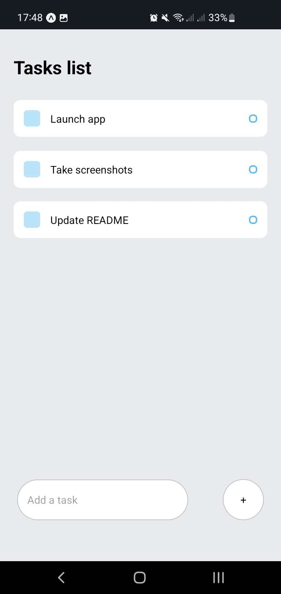

<h1 align="center">React Native Todo</h1>

---

## 📝 Table of Contents

- [About](#about)
- [Prerequisites](#prerequisites)
- [Running the app](#running-the-app)

## About

A simple todo list app built in React Native. There are ideas and issues raised to expand on this initial implementation in the future, but no set date or plans currently. This project should be treated as inactive and will not be maintained for the forseeable future.

## Prerequisites

- Node
- Expo app (preferrably on Android)

## Running the app

- Run `npm i` in your terminal to install the required dependencies.
- Run `npm start` in your terminal to start the app. This will produce a QR code which you can scan in the Expo app to view the app.
